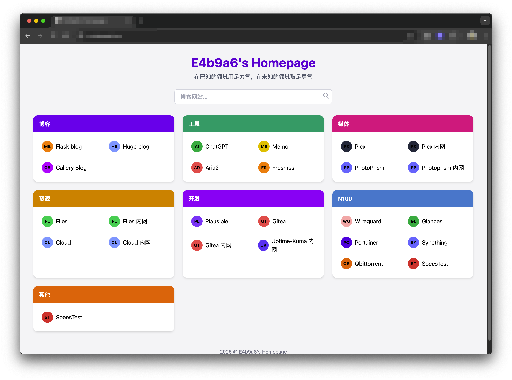

# Personal Navigation Homepage  

A clean and elegant personal navigation page built with HTML, TailwindCSS, and YAML configuration.  



## Project Structure  

The project contains only 2 files:  

```
.
├── config.yaml        # Site configuration file (categories & links)
├── index.html         # Main application page
```  

## Features  

Key features include:  
- Responsive design powered by TailwindCSS  
- Configurable categories and links via YAML  
- Real-time search functionality  
- Hover effects and modern UI  

## Deployment  

Serve `index.html` via nginx:  

Deployment steps:  
1. Clone the repository  
2. Copy config file: `cp .config.yaml config.yaml`  
3. Modify `config.yaml` as needed  

Sample nginx configuration:  

```conf
server {
    listen 80;  
    server_name your_domain.com;  

    root /path/tailwind-homepage;  
    index index.html;  

    location / {
        try_files $uri $uri/ =404;  
    }

    error_page 404 /404.html;  
    location = /404.html {
        internal;  
    }
}
```  

## Technologies  

This project uses:  
- TailwindCSS (via CDN)  
- js-yaml for YAML parsing  
- Python's built-in HTTP server for development  

For debugging in VSCode, use this `.launch.json`:  

```json
{
    "version": "0.2.0",
    "configurations": [
        {
            "name": "Python: HTTP Server",
            "type": "debugpy",
            "request": "launch",
            "module": "http.server",
            "args": ["8000"],
            "console": "internalConsole"
        }
    ]
}
```